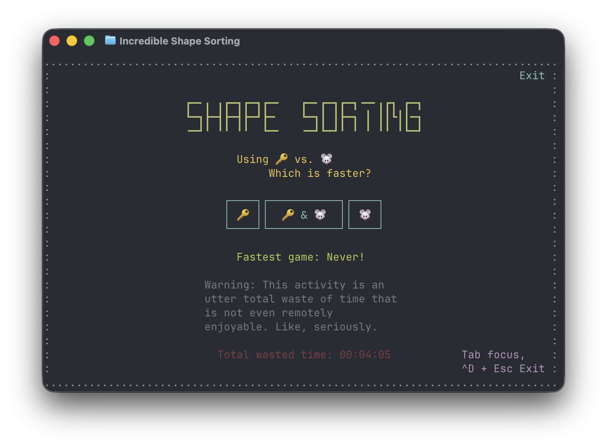
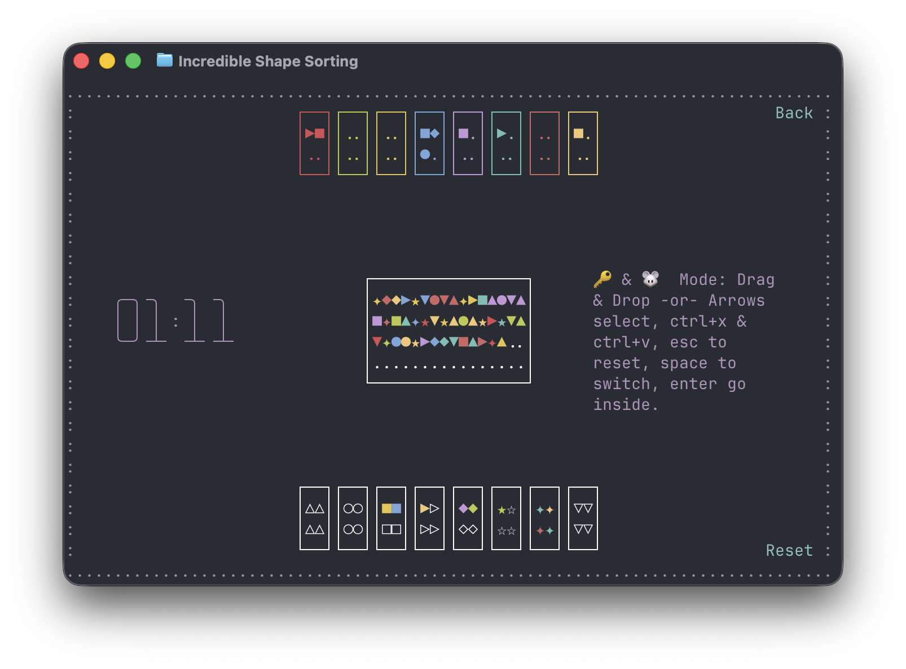

# Shape Sorting

**So, which input device offers better productivity, the keyboard or the mouse?**

Let's find out.

Shape Sorting is a game, or, ok maybe better, an activity, about sorting shapes by color or shape, played with the keyboard, the mouse, or both.

It's written in [Rust](https://www.rust-lang.org/) using the [Incredible](https://www.incredible.rs/) TUI framework. It can be played, or, ok maybe better, it can be experienced, in the terminal, using native macOS and Windows app or [right here in the browser](https://ronilan.github.io/shape-sorting/).


<p align=center></p>

> **⚠️ Warning**
> *This activity is an utter total waste of time that is not even remotely enjoyable. Like, seriously.*

# Install

## Web

No install needed: https://ronilan.github.io/shape-sorting/

## Native binaries

Prebuilt binaries are provided for each [release](https://github.com/ronilan/shape-sorting/releases).

## Linux via Docker

To try the Linux terminal version, build and run:

```
docker build -t shape_sorting .
docker run --rm -it shape_sorting
```

Type `shape_sorting` in the container shell to launch.

## TUI Install / Uninstall

Installs the latest release binary — `/usr/local/bin` (macOS/Linux) or `C:\Program Files\shape_sorting` (Windows).

```bash
curl --proto '=https' --tlsv1.2 -sSf https://raw.githubusercontent.com/ronilan/shape-sorting/main/install.sh | bash
```

```powershell
irm https://raw.githubusercontent.com/ronilan/shape-sorting/main/install.ps1 | iex
```

Uninstall the same way with `uninstall.sh` / `uninstall.ps1`. 

# Play

- Splash screen: pick your input mode — keyboard (🔑), mouse (🐭), or both (🔑 & 🐭). Press **Enter** (or click) to start.
- Sort shapes from the shape box into the drop boxes, by **shape** or by **color**.
- When the shape box is emptied, your time is shown.

## Keyboard controls (🔑)

- **Arrow keys** — select
- **Ctrl+X** — pick up a shape
- **Ctrl+V** — place the carried shape
- **Esc** — cancel the carried shape / reset
- **Space** — switch
- **Enter** — go inside

## Mouse controls (🐭)

- **Drag & drop** — carry shapes from the shape box into the drop boxes

In the mixed mode (🔑 & 🐭) either set of controls works.

## Files

Your fastest game and total time wasted are saved between runs in a per-user file:

- **macOS:** `~/Library/Application Support/shape_sorting/.shape_sorting`
- **Linux:** `~/.local/share/shape_sorting/.shape_sorting`
- **Windows:** `%APPDATA%\shape_sorting\.shape_sorting`

The web version stores your stats in the browser's local storage. If the file can't be written (or the browser blocks storage), the game simply runs without saving — nothing crashes.

# Other ways to install

## Look before you run

If you prefer to inspect the installer scripts before running them, download first, then execute:

**macOS / Linux:**

```bash
curl --proto '=https' --tlsv1.2 -sSf https://raw.githubusercontent.com/ronilan/shape-sorting/main/install.sh -o install.sh
bash install.sh
```

**Windows:**

```powershell
Invoke-WebRequest -Uri "https://raw.githubusercontent.com/ronilan/shape-sorting/main/install.ps1" -OutFile install.ps1
powershell -ExecutionPolicy Bypass -File install.ps1
```

## Manual install

**macOS / Linux** — download the binary for your platform from the [latest release](https://github.com/ronilan/shape-sorting/releases), then move it to `/usr/local/bin` (a centralized folder on the default PATH) and give it execution permissions:

```bash
sudo mv shape_sorting /usr/local/bin/
sudo chmod +x /usr/local/bin/shape_sorting
```

**Windows** — download `shape_sorting-terminal-windows.zip` from the [latest release](https://github.com/ronilan/shape-sorting/releases), create a dedicated folder (e.g. `C:\Program Files\shape_sorting\`), place `shape_sorting.exe` inside it, then search Windows for "Environment Variables", edit the system variables, and append that folder to the system PATH.

Verify it works by opening a new terminal anywhere and typing `shape_sorting`. If the program responds, it is correctly placed.


## Development

See [Development](./markdowns/DEVELOPMENT.md) and [Development Environment Prerequisites](./markdowns/DEVELOPMENT_PREREQUISITES.md)

---

*Fabriqué au Canada : Made in Canada 🇨🇦*